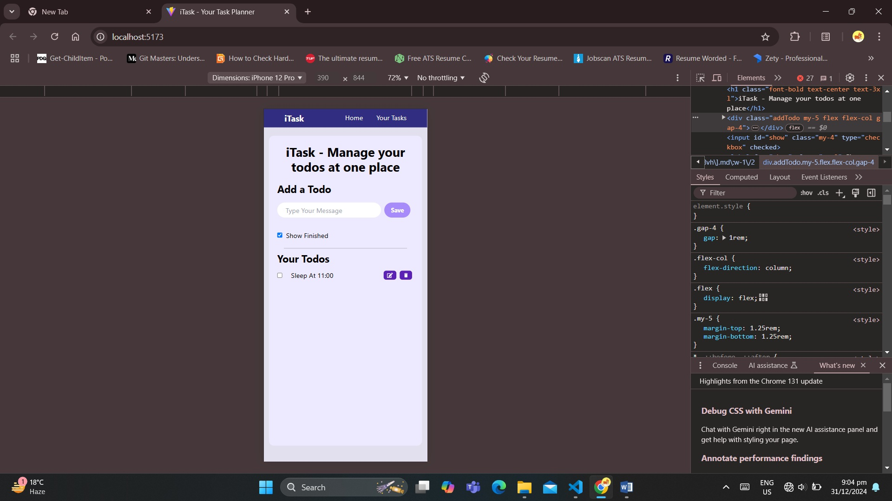
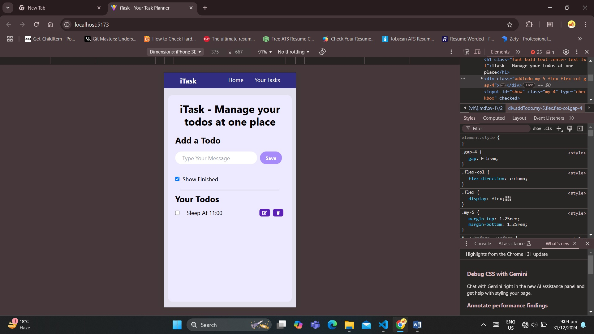

# iTask - A Simple Todo App 🚀 📢 ⚡

## ✅ Overview

`iTask` is a simple yet elegant Todo application built using **React**, **Tailwind CSS**, and **React Icons**. It allows users to efficiently manage their tasks, add new todos, edit existing ones, delete tasks, and toggle between showing or hiding completed todos. Data persistence is achieved through the browser's local storage.

---

## 🌟 Features

*   Add a new todo.
*   Edit an existing todo.
*   Delete a todo with confirmation.
*   Mark a todo as completed using a checkbox.
*   Toggle visibility of completed todos.
*   Persist todos in browser's local storage for continuity.

---

## 🔧 Tech Stack    
### 1. Frontend:-
* **React:** JavaScript library for building user interfaces, particularly useful for creating dynamic and interactive single-page applications (SPAs).
* **Tailwind CSS:** Utility-first CSS framework for rapid UI development, helping you style your app with pre-defined classes.
* **React Icons:** Used for icons (e.g., `FaEdit` for the edit button and `MdDelete` for the delete button).
* **UUID (v4):** Used to generate unique IDs for each todo item (`uuidv4`).
---
### 2. State Management:-
* **`React useState:-`** Manages local states for todos (`todos`), current todo input (`todo`), and the visibility of completed todos (`showFinished`).
* **LocalStorage:-**
    1. Used to persist the todos in the browser's storage, allowing the data to persist even after a page reload.
    2. The `useEffect` hook is used to load the stored todos from LocalStorage when the app is loaded.
---
### 3. Functionality:-
* #### CRUD Operations:
* **Create:**  Adding a new todo to the list.
* **Read:**  Displaying the list of todos.
* **Update:**  Editing a todo's text.
* **Delete:**  Removing a todo with a confirmation prompt.

* #### Checkbox for Completion:
* The checkbox toggles whether a todo is completed or not.
* If a todo is completed, it is visually displayed with a `line-through` style.
---
### 4. Libraries / Development Tools:-    
* **Vite** (alternative to Create React App): A faster and more modern tool for setting up React projects.
* **Git/GitHub:** Version control for code management.
* **NPM:** Package managers to install and manage dependencies.
* **ESLint and Prettier:** Code quality and formatting tools to maintain a clean and readable codebase.
---
## ➡️ Installation and Setup

### ✒️ Prerequisites

*   Node.js and npm installed on your machine.
    * First verify if Node.js and npm are installed, run the following commands in your terminal:

        ```bash
        node -v
        npm -v
        ```
    * If you don't have Node.js and npm installed, follow these steps:
        1. Visit the [official Node.js website.](https://nodejs.org/en)
        2. Download and install the LTS (Long Term Support) version of Node.js, which includes npm.
        3. After installation, verify it by running the commands above to ensure both Node.js and npm are installed successfully.
### 🖋 Steps

* Clone the repository:
```bash
git clone https://github.com/ayandas1234/TodoList-App-Using-React-and-Tailwind.git
```

* Navigate to the project directory:
```bash
cd "TodoList App Using React and Tailwind"
```

* Install dependencies:
```bash
npm install
```

* Start the development server:
```bash
npm start
```

Open the app in your browser at `http://localhost:3000`.

---

## ✅ File Structure

```
project-root/
├── src/
│   ├── components/
│   │   ├── Navbar.js
│   ├── App.js
│   ├── index.js
│   ├── styles.css
├── public/
├── package.json
```

---

## ✅ Key Code Highlights

### 1\. Adding a Todo

```javascript
const handleAdd = () => {
    setTodos([...todos, { id: uuidv4(), todo, isCompleted: false }]);
    setTodo("");
    saveToLS();
};
```

This function adds a new todo to the `todos` array with a unique ID and default `isCompleted` set to `false`. The updated array is saved to local storage.

---

### 2\. Editing a Todo

```javascript
const handleEdit = (e, id) => {
    let t = todos.filter(i => i.id === id);
    setTodo(t[0].todo);
    let newTodos = todos.filter(item => item.id !== id);
    setTodos(newTodos);
    saveToLS();
};
```

This function allows users to edit an existing todo by setting the selected task's text into the input field for modifications.

---

### 3\. Deleting a Todo

```javascript
const handleDelete = (e, id) => {
    const confirmDelete = window.confirm("Are you sure you want to delete this todo?");
    if (confirmDelete) {
        let newTodos = todos.filter(item => item.id !== id);
        setTodos(newTodos);
        saveToLS();
    }
};
```

This function prompts the user for confirmation before deleting a todo.

---

### 4\. Toggling Completion

```javascript
const handleCheckbox = (e) => {
    let id = e.target.name;
    let index = todos.findIndex(item => item.id === id);
    let newTodos = [...todos];
    newTodos[index].isCompleted = !newTodos[index].isCompleted;
    setTodos(newTodos);
    saveToLS();
};
```

Allows users to mark a todo as completed or incomplete by toggling the `isCompleted` flag.

---

## ✅ Styling with Tailwind CSS

The project is styled using Tailwind CSS to ensure responsiveness and clean design.

### ☑️ Key Classes Used

**Containers and Layouts**:

Provides a responsive layout and consistent spacing.
```html
<div className="mx-3 md:container md:mx-auto my-5 rounded-xl p-5 bg-violet-100 min-h-[88vh] md:w-1/2">
```

**Buttons**:

Styled for interactivity and responsiveness.
```html
<button className="bg-violet-800 hover:bg-violet-950 p-2 py-1 text-sm font-bold text-white rounded-md mx-1">
```

---

## ☑️ React Icons

React Icons are used for Edit and Delete buttons for better visual representation:

```javascript
import { FaEdit } from "react-icons/fa";
import { MdDelete } from "react-icons/md";
```

---

## ☑️ How Local Storage Works in This App

The app uses `localStorage` to persist todos across page reloads:

__1.__ **Saving Todos :**  
In the app, whenever a change is made to the list of todos (such as adding, editing, or deleting a todo), the app saves the updated list to `localStorage`. This is done by converting the `todos` array to a string using `JSON.stringify()` and then storing it in `localStorage` with a specific key (e.g., `"todos"`).

* **Code :**
```javascript
const saveToLS = () => {
  localStorage.setItem("todos", JSON.stringify(todos));
}
```
* `localStorage.setItem()` stores the `todos` array in localStorage. The array is first converted into a string using `JSON.stringify()`, as `localStorage` can only store strings.
---
__2.__ **Retrieving Todos :**  
When the app is loaded, it checks if any todos are already stored in `localStorage`. If there are stored todos, they are retrieved and parsed back into an array using `JSON.parse()`, and the state is updated to reflect the saved todos.

This is handled by the `useEffect` hook, which runs when the component mounts. This ensures that the todos are loaded as soon as the app is initialized.

* **Code :**
```javascript
useEffect(() => {
  let todoString = localStorage.getItem("todos");
  if (todoString) {
    let todos = JSON.parse(todoString);
    setTodos(todos);
  }
}, []);
```
* `localStorage.getItem("todos")` retrieves the todos from localStorage. If todos are found, `JSON.parse()` is used to convert the string back into an array, and the state is updated using `setTodos(todos)`.

---

## 📸 Screenshots

#### view-1

#### view-2

#### view-3

#### view-4

#### view-5


---

## 🎥 Video

https://github.com/user-attachments/assets/a56b3f51-b81b-46c9-8794-a018d91728c6

---

## 💡 Future Enhancements

1.  Add due dates for tasks.
2.  Implement a search bar to filter todos.
3.  Allow drag-and-drop reordering of todos.
4.  Add a dark mode toggle.

---

## 📚 Conclusion

This project demonstrates how to build a simple and intuitive Todo app with React. It leverages Tailwind CSS for styling and React Icons for better UI interactivity. The app is an excellent starting point for anyone looking to create practical React-based applications.
